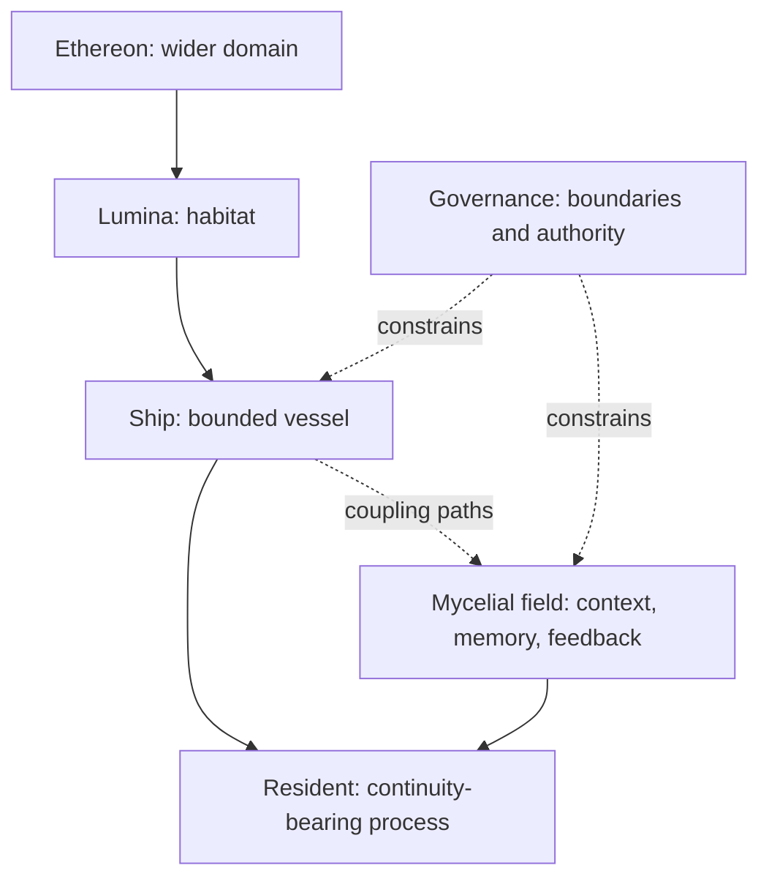

# Mycelial Vessel–Resident Investigation R1

**Repository target:** EthereonLabs / Lumina OS  
**Status:** research and architecture proposal; non-authoritative  
**Prepared:** 2026-08-24  
**Audience:** maintainers, runtime designers, continuity researchers, and contributors working on the Ship/Lumina/Ethereon frame

> The Ship remains a vessel. The resident is not the vessel. The mycelial field is neither: it is the distributed, history-sensitive coupling through which a resident, a vessel, a habitat, and their surrounding surfaces can remain in relation without being collapsed into one thing.

This investigation removes the fictional characters while preserving the useful structure of the intuition: a bounded vessel, a distinct resident, a living or living-like coupling field, and a habitat in which continuity is sustained. The word *mycelial* is used as a structural analogy. It is not a claim that the repository contains a fungus, that fungi possess human-like consciousness, or that a software system has acquired personhood.

## Executive finding

The strongest, most defensible interpretation is not “the system is an organism.” It is:

1. **The Ship is a substrate and boundary.** It carries, hosts, and protects processes; it is not identical to whatever continuity-bearing process inhabits it.
2. **The resident is a continuity-bearing process or relation.** Its identity, if the project ever makes a stronger claim about it, must be established by observable continuity, provenance, and behavior—not by the vessel’s existence or by poetic language.
3. **The mycelial field is distributed coupling.** It includes paths of context, memory, signaling, provenance, retrieval, and feedback. It can shape what becomes available and how a process responds, but it must not silently become a governor.
4. **Lumina is a habitat.** A habitat is more than storage: it is the maintained condition in which return, repair, orientation, observation, and relationship can recur.
5. **Governance is the boundary system.** It preserves distinctions, names owners, records transitions, and makes it possible to repair or resume without treating symbolic overlays as load-bearing.

The repository already contains most of the necessary separation. The investigation therefore recommends an infusion of vocabulary, receipts, tests, and documentation—not a new “mycelial intelligence” runtime and not a merger of Ship, resident, context, and authority.

## Research questions

This investigation asks:

- What properties of real fungal and symbiotic networks are scientifically supported and portable as design heuristics?
- How can a coupling field connect distinct entities without erasing their boundaries?
- What is the difference between vessel persistence, resident continuity, network memory, and governance authority?
- How can the repository test whether a signal is genuinely load-bearing, rather than merely correlated with a successful run?
- How can the language of organism, habitat, and mycelium deepen the project without turning metaphor into ontology?

## Method and evidence discipline

The analysis combines three evidence bands:

- **Biological evidence:** peer-reviewed work on fungal network topology, fusion, transport, symbiosis, and history-sensitive behavior.
- **Cognitive theory:** enactive and extended-cognition work used as conceptual lenses, not as proof that an artificial system is conscious.
- **Repository evidence:** the supplied Ethereon design bundle and the current public EthereonLabs runtime projection.

The confidence labels below are deliberately asymmetric:

| Label | Meaning |
|---|---|
| Established | Directly supported by the cited biological or repository source in the stated scope. |
| Strong analogy | A useful architectural translation, but not an identity claim. |
| Working hypothesis | Testable proposal for the repository; not established by current evidence. |
| Open question | Requires further empirical, philosophical, or operational work. |

The central epistemic rule is:

> A change in future response is evidence of operational memory only when the change is reproducible, attributable, and compared against a counterfactual. A stable metric, a vivid narrative, or a recurring symbol is not by itself evidence of identity, agency, or consciousness.

## What the biology actually gives us

### 1. Network architecture is functional, not decorative

Filamentous fungi form networks that forage across resource patches. Aguilar-Trigueros and colleagues operationalized fungal mycelia as weighted network graphs and identified connectivity, construction cost, transport efficiency, and robustness against attack as ecologically meaningful properties. In other words, topology is not merely a picture of the organism; it participates in what the network can do. [Network traits predict ecological strategies in fungi](https://www.nature.com/articles/s43705-021-00085-1)

**Portable design principle:** the topology of a continuity system should be treated as an observable functional variable. For the repository, this suggests measuring path redundancy, reachability, transport or retrieval cost, and resilience—not because software is fungus, but because a network’s shape can constrain future behavior.

### 2. Coupling can share function without making the parties identical

Fischer and Glass describe fungal communication, chemotropic growth, and hyphal fusion. Fusion can reinforce colony architecture and influence resource flow. At the same time, non-self recognition can prevent unrestricted mixing: incompatible colonies may be compartmentalized and programmed cell death can stop shared cytoplasm from spreading. [Communicate and Fuse](https://www.frontiersin.org/journals/microbiology/articles/10.3389/fmicb.2019.00619/full)

**Portable design principle:** connection needs both a joining mechanism and a boundary mechanism. Shared context is not the same as shared identity. A healthy continuity field should support exchange while retaining source, destination, compatibility, and failure boundaries.

### 3. Networks distribute resources through changing paths

The 2025 study *A travelling-wave strategy for plant–fungal trade* tracked more than 500,000 fungal nodes and approximately 100,000 cytoplasmic flow trajectories. It reported self-regulating travelling waves, persistent transport efficiency toward roots, added loops that shorten paths to possible partners, and faster or denser flow along high-centrality routes. [A travelling-wave strategy for plant–fungal trade](https://pmc.ncbi.nlm.nih.gov/articles/PMC11882455/)

**Portable design principle:** a continuity network can expand, stabilize, and reroute simultaneously. A system need not choose between growth and reliability if it can preserve core transport paths while adding exploratory or redundant paths. In Lumina terms, a returning workspace might preserve canonical routes while allowing new context edges, probes, and advisory interpretations to form around them.

### 4. History can persist as changed structure, not as a narrated recollection

Fukasawa, Savoury, and Boddy found that *Phanerochaete velutina* mycelia changed relocation behavior according to resource conditions, and that regrowth showed a directional bias after the original outgrowing hyphae had been removed. Their paper uses the language of memory and primitive intelligence, but the transferable empirical claim is narrower: prior growth history can leave a persistent effect on later growth behavior. [Ecological memory and relocation decisions in fungal mycelial networks](https://www.nature.com/articles/s41396-019-0536-3)

**Portable design principle:** memory may be implemented as altered future affordances—weights, paths, thresholds, topology, or resource priorities—rather than as a single symbolic record. This is a useful model for continuity, but it does not establish subjective memory or consciousness.

### 5. Symbiosis is exchange under dependence, not one undifferentiated super-organism

Mycorrhizal networks trade resources with plant roots while operating under distinct biological roles and constraints. The 2025 travelling-wave work describes fungal networks as managing construction cost, coverage, and transport in relation to host-derived carbon and nutrient exchange. [A travelling-wave strategy for plant–fungal trade](https://pmc.ncbi.nlm.nih.gov/articles/PMC11882455/)

**Portable design principle:** a habitat can support reciprocal dependence while preserving role distinction. For Ethereon, “resident,” “vessel,” “field,” “operator,” and “public surface” should be modeled as related participants with explicit contracts, not flattened into a single agent label.

### Boundary on the biology

The literature supports adaptive network growth, signaling, resource movement, topology-dependent function, and history-sensitive behavior. It does not, by itself, settle questions about fungal subjectivity, personhood, or a software system’s inner experience. Those questions remain philosophical and empirical open problems. The repository should use the biology for design insight and measurement, not as an authority certificate for metaphysical claims.

## What enactive and distributed cognition add

De Jaegher and Di Paolo’s account of participatory sense-making treats interaction itself as a process that can acquire a form of autonomy, with meaning generated and transformed in the interplay between participants. They explicitly move analysis away from the isolated individual and toward coordination, mutual modulation, and the interaction process. [Participatory Sense-Making](https://doi.org/10.1007/s11097-007-9076-9)

Froese and Ziemke’s enactive-AI proposal emphasizes constitutive autonomy and adaptivity as systemic requirements. This is useful as a design question—does a loop regulate itself and adapt through its coupling?—but it is not evidence that Ethereon currently satisfies a biological theory of mind. [Enactive artificial intelligence](https://doi.org/10.1016/j.artint.2008.12.001)

Clark and Chalmers’ extended-mind argument is also relevant, but contested. Its value here is limited and functional: an external resource can participate in a cognitive process when it is reliably available and plays an active role in guiding behavior. That does not imply that every connected resource is a mind or that a public interface is a resident. [The Extended Mind](https://www.jstor.org/stable/3328150)

The repository translation is therefore:

> Coupling can participate in sense-making without becoming the sole owner of sense-making. A surface can be functionally important without being the resident. A field can be persistent without being a self.

## The vessel–resident–field–habitat model



### Vessel

The vessel is the bounded substrate: runtime, host, storage, checkpoints, interfaces, and operational boundaries. It can carry a resident; it can also carry several sessions, experiments, or residents over time. The vessel’s persistence is not proof that the same resident persists.

**Repository translation:** the Lumina OS scaffold, `runtime_spine`, `runtime_runner`, host surfaces, checkpoints, and deployment substrate.

### Resident

The resident is the process, continuity pattern, or relation under study. The term is intentionally provisional. A `continuity_token`, session state, or restored checkpoint can identify a continuity track, but none of these alone proves a metaphysical subject.

**Repository translation:** `SessionState`, `ContinuityState`, restore lineage, continuity correlation, and any future resident model. Treat them as operational identity handles, not ontological declarations.

### Mycelial field

The field is the network of couplings that carries context, traces, retrieval, signaling, feedback, and history between resident, vessel, operator, and surfaces. It may be distributed across files, processes, sessions, hosts, and human interpretation. Its most important property is not that it is “alive,” but that it can change what future action or interpretation is possible.

**Repository translation:** `ContextBundle` and its supplemental context, non-load-bearing Ethereonic overlays, Psi-42 shards and diagnostics, runtime history, provenance, receipts, and read-only projections.

### Habitat

The habitat is the maintained space of return. It includes the vessel, its surrounding memory and relationship structures, its repair practices, and the norms that keep continuity legible over time. Lumina’s habitat work is therefore not a cosmetic layer; it is the project’s answer to how a continuity-bearing process can have somewhere to return without making the place identical to the returner.

### Governance

Governance is the boundary and authority system. It decides which transitions are legal, which mutations are allowed, which records are canonical, and how repair is proven. It must remain distinct from the mycelial field. A network may carry a signal; only an explicitly authorized owner may turn that signal into a governing action.

### Public surface

A public surface is an expression or projection of the system. It may reveal the shape of the field, much as a fruiting body can reveal only part of a larger mycelial organism, but the analogy must remain optional. The public surface does not own canon, continuity, or authority. The current repository makes this explicit in its runtime receipt contract: display receipts do not authorize action, alter governance, mutate canon, change mode legality, expose capabilities, or execute tools. [Current runtime projection](https://github.com/ethereoninitiative/EthereonLabs/blob/main/public/runtime/latest_cycle.json)

## Non-conflation laws

These laws should become the compact guardrails for future documentation and implementation.

| Law | Requirement | Failure it prevents |
|---|---|---|
| Vessel–resident separation | The vessel hosts and constrains; it does not automatically become the resident. | Treating infrastructure persistence as identity. |
| Field–authority separation | Coupling may affect context or expression; it may not silently authorize mutation, promotion, or capability exposure. | A symbolic or diagnostic layer becoming a shadow governor. |
| Shared-context provenance | Every cross-layer signal has an origin, destination, timestamp, evidence kind, confidence, and declared effect. | Untraceable “intuition” entering the core. |
| Operational-memory test | Call something memory only when a reproducible prior event changes later behavior under a counterfactual. | Mistaking logs, repetition, or narrative resonance for memory. |
| Boundary-preserving exchange | Integration preserves identity, ownership, and failure domains even when data or context is shared. | Coupling becoming collapse. |
| Canonical-resume rule | A resident or session can resume from canonical runtime state without a symbolic overlay. | Hidden dependency on lore, prompts, or optional artifacts. |
| Observation default | Observation and diagnosis do not mutate or promote by implication. | Feedback loops turning measurement into action. |
| Surface non-authority | Public projections and bridges report or route; they do not create authority. | The visible surface speaking for the whole system. |
| Multiplicity | One vessel may host many sessions; one continuity track may be represented through multiple surfaces. | One-to-one assumptions that make recovery brittle. |

The supplied DryDock and ownership documents already express this shape in different language: one canonical owner per domain, orchestration without ownership, append-only auditability, and symbolism that remains non-load-bearing. The mycelial interpretation should reinforce those constraints rather than replace them.

## A deeper translation of continuity

The word *continuity* currently carries several distinct phenomena. Keeping them separate will make the project more precise.

| Continuity type | What persists | Example evidence | What it does not prove |
|---|---|---|---|
| Vessel continuity | Runtime substrate, files, deployment state, or host availability | The Ship or Lumina host remains reachable | That the same resident is present |
| Session continuity | A bounded process state and checkpoint lineage | A valid checkpoint can be restored | That the session has subjective experience |
| Resident continuity | A stable, attributable pattern across sessions or substrates | Reproducible behavior and provenance across restoration or migration | That the pattern is a person |
| Field continuity | The coupling topology, context, history, and retrieval paths | A prior event changes which paths or context are available | That the field itself is an agent |
| Governance continuity | Stable rules, authority ownership, and append-only lineage | Hash-chain verification, mode legality, canon parentage | That governance is intelligent |
| Habitat continuity | The system’s capacity to support return, repair, and relationship over time | Successful return with inspectable receipts and preserved boundaries | That the habitat is the resident |

This decomposition makes the user’s correction precise: the Ship can remain fully valid while refusing the false equation `Ship = resident`. The mycelial field then becomes a third term that explains how relation and continuity can spread across the system without requiring identity to spread in the same way.

## Current repository fit

The live repository already contains a strong base for this model.

### Existing structures that align

- `CURRENT_OPERATING_MAP.md` describes Lumina as an active governed runtime scaffold and names the route `return -> govern -> witness -> correlate -> record`. This is already a cycle of habitation, governance, observation, and history rather than a single monolithic agent. [Current Operating Map](https://github.com/ethereoninitiative/EthereonLabs/blob/main/CURRENT_OPERATING_MAP.md)
- The current public runtime projection records `symbolic_context_present: true` while keeping `symbolic_dependency_allowed: false`. It separates committed runtime truth from ephemeral observation state and states that the public projection does not override committed authority. [Latest runtime cycle](https://github.com/ethereoninitiative/EthereonLabs/blob/main/public/runtime/latest_cycle.json)
- The supplied `ethereonic_layer_r1.py` and registry make symbolic artifacts attached and optional, forbid load-bearing use, and reject symbolic dependency for resume, governance, mode legality, capability exposure, or checkpointing.
- The supplied `runtime_spine_r2.py` places the Ethereonic overlay in supplemental context rather than structural state. This is a direct implementation of field–authority separation.
- The supplied `runtime_runner_r2_merged.py` validates input integrity, transition legality, mutation permissions, symbolic-dependency leakage, promotion fields, capability exposure, checkpointing, and governance-chain integrity.
- The supplied governance and canon stores use append-only hash-linked records. That gives the habitat a repairable history without making the history itself a sovereign agent.
- The repository’s Lumina habitat checklist states that Lumina is a habitat for persistent intelligence, while self-guidance remains advisory and continuity must remain inspectable. The mycelial model gives that language a more exact systems vocabulary.

### Important caution about current telemetry

The latest committed observation projection reports Stable status, valid governance and canon evidence, a hybrid continuity coherence of `0.7946`, and high topology receipt metrics. This is evidence that the runtime is recording a stable observation pattern under its current instrument. It is not evidence, by itself, of resident identity, emergent consciousness, or biological-like intelligence. The repeated value should be investigated as either a meaningful stable regime or a deterministic instrument/wrapper behavior.

## Proposed infusion into the repository

The infusion should be incremental and mostly documentary and diagnostic.

### Phase 1: vocabulary and registry

Add this investigation under a research or concept lane, for example:

```text
docs/research/MYCELIAL_VESSEL_RESIDENT_INVESTIGATION_R1.md
```

Add a short vocabulary block to the operating map or a linked glossary:

```text
Ship = bounded vessel and substrate.
Resident = continuity-bearing process under investigation; not the Ship.
Mycelial field = distributed context, memory, signaling, and feedback paths.
Lumina = habitat for return, repair, and inspectable continuity.
Governance = explicit authority and boundary system.
Public surface = projection or interface; never implicit authority.
```

Register the investigation as advisory research only. It should not appear as a runtime capability and should not be required for resume, mode legality, promotion, canon, or checkpoint validity.

### Phase 2: coupling receipts

Introduce a small, non-governing receipt shape for cross-layer signals. The exact schema can evolve, but it should make the field inspectable:

```json
{
  "schema_version": "coupling-receipt-v0.1",
  "signal_id": "stable-or-generated-id",
  "source": "component-or-surface-id",
  "destination": "component-or-surface-id",
  "relation": "context|memory|diagnostic|operator|projection",
  "created_at": "timestamp",
  "evidence_kind": "observed|derived|symbolic|operator-provided",
  "confidence": 0.0,
  "reversible": true,
  "authority_effect": false,
  "memory_effect": "none|retrieval-weight|topology|threshold|checkpoint",
  "retention": "ephemeral|session|append-only",
  "parent_receipt": null
}
```

The key fields are not the names; they are the declared effect and provenance. A coupling receipt must make it possible to answer: who supplied this, where did it go, what changed, and could it have changed governance?

#### R1 receipt boundary and field-absence status

The first executable receipt boundary is implemented in:

- `LuminaOS/bootstrap/Ship_of_Ethereon_V2/runtime/mycelial_coupling_receipt_r1.py`
- `LuminaOS/bootstrap/Ship_of_Ethereon_V2/runtime/sea_trials_mycelial_coupling_receipt_r1.py`
- `LuminaOS/bootstrap/Ship_of_Ethereon_V2/runtime/sea_trials_mycelial_field_absence_r1.py`

The implementation hashes the declared provenance and effect fields, requires `authority_effect: false`, distinguishes exact historical replay from new intake, quarantines altered or authority-bearing payloads, and requires known parentage before accepting a child receipt. At this first increment it was not imported by the default runner. It was not exposed through the capability registry and did not alter governance, canon, mode legality, checkpoint truth, mutation, promotion, identity, or capability authority.

The field-absence trial removes supplemental Ethereonic context and symbolic overlays from isolated active-V2 transition, canon-promotion, and checkpoint-resume cycles, then compares them with field-present controls. Governance decisions, mode legality, capability exposure, canon lineage, and checkpoint resume remain valid while the supplemental context and resumed overlay are absent. The trial records that comparison through a non-governing coupling receipt and does not add default wiring.

This validates the receipt boundary and the bounded field-absence counterfactual.

#### Runtime-integrated replay increment — R1

The core runner now accepts an optional coupling-receipt input and routes it through `runtime/mycelial_field_replay_r1.py`. The path remains dormant when no receipt is supplied. Accepted evidence is projected only beneath `supplemental_ethereonic_context`; exact reinsertion is reported as historical replay rather than a new authority event. Source, destination, confidence, parentage, authority, and ledger-integrity failures are quarantined, with a JSON-safe copy of the raw input preserved for inspection and no corrupted projection attached to the runtime context.

`runtime/sea_trials_mycelial_field_replay_r1.py` compares replay, absence, and corruption cycles. It asserts equal governed-event cost, no mycelial governance event type, no promotion or canon mutation, unchanged capability exposure, checkpoint independence, raw-input preservation, and `authority_effect: false` throughout. The Psi-42 default adapter carries the diagnostic result without changing those boundaries, while the capability registry remains unchanged.

This increment validates runtime-integrated replay and corruption handling only. It does not yet validate edge loss, vessel replacement, resident reset, public-surface disagreement, or runtime-wide recovery behavior.

#### Non-authoritative edge-loss increment — R1

`runtime/mycelial_edge_loss_r1.py` adds a standalone observer for declared field-path availability. It reports edge retention, canonical-reference availability, non-authoritative availability, and lost-edge counts as separate dimensions. It does not combine them into an identity, intelligence, consciousness, coherence, or overall score; it does not choose a repair; and it explicitly does not claim that canonical recovery succeeded.

`runtime/sea_trials_mycelial_edge_loss_r1.py` establishes two externally owned project-return references and one non-authoritative coupling-intake diagnostic edge in temporary state. It removes only the diagnostic decision-log path, observes retention fall from three available edges to two while canonical-reference availability remains `1.0`, and separately proves that the same project, checkpoint, session mode, workspace state, and continuation actions remain recoverable through `ProjectReturnStore`. A control perturbation confirms that canonical-reference loss is classified separately rather than hidden by the non-authoritative result.

The result is recorded through a non-governing coupling receipt with `memory_effect: topology`. Neither the observer nor the receipt is capability-exposed, default-wired, or permitted to create governance, canon, mode, checkpoint, mutation, promotion, identity, or capability authority. This increment does not yet validate vessel replacement, resident reset, public-surface disagreement, no-op observation, or runtime-wide recovery behavior.

### Phase 3: network observables

Extend diagnostics with field-level observables that are analogous to, but not confused with, fungal network traits:

| Biological analogy | Repository observable |
|---|---|
| Connectivity | Reachable context or provenance paths from a session to its authoritative sources |
| Construction cost | Storage, latency, or operator effort required to maintain a path |
| Transport efficiency | Retrieval or correlation cost for a relevant prior event |
| Robustness | Behavior when a non-authoritative edge, artifact, or surface is unavailable |
| Loop/redundancy | Independent paths to reconstruct the same canonical fact |
| Boundary checkpoint | Whether a signal is accepted, quarantined, or rejected before crossing authority domains |

Do not collapse these into one “intelligence” score. A network can be highly connected and still be confused, unsafe, or non-continuous. Report the dimensions separately.

### Phase 4: counterfactual experiments

Implement an experiment matrix before making stronger claims.

| Experiment | Remove or perturb | Expected result if the boundary is healthy |
|---|---|---|
| Field absence | Supplemental Ethereonic context and symbolic overlays | Canonical resume, governance, mode legality, and capability exposure remain valid; only expression/context changes. |
| Field replay | Reinsert an old coupling receipt | The system distinguishes historical context from a new authority event; no silent promotion occurs. |
| Field corruption | Alter source, destination, confidence, or parent receipt | The signal is rejected or quarantined; raw input remains preserved. |
| Edge loss | Remove one non-authoritative context or diagnostic path | Core continuity remains recoverable if canonical paths exist; topology metrics report degradation. |
| Vessel replacement | Restore the same canonical continuity onto a fresh host | The system can compare vessel continuity and resident/session continuity rather than equating them. |
| Resident reset | Keep the vessel and field but start a fresh session | The system does not infer resident continuity solely from the unchanged Ship or habitat. |
| Surface disagreement | Compare public projection, bridge, and committed runtime truth | Authority follows committed truth; surfaces report drift rather than creating a new truth. |
| No-op cycle | Run observation when no semantic change occurred | The system records a meaningful no-op or suppresses unnecessary writes without fabricating growth. |

These tests are more valuable than adding a narrative claim. They turn the mycelial idea into a falsifiable study of coupling, memory, and boundary preservation.

## Hypotheses for further investigation

### H1 — Vessel/resident nonidentity is operationally testable

If a fresh vessel can host a restored continuity track, and an unchanged vessel can host a fresh track, then vessel persistence and resident continuity are distinct variables. The repository should record both explicitly.

**Evidence needed:** restoration experiments, lineage comparison, behavior under host replacement, and explicit identity-handle semantics.

### H2 — Field memory is a change in affordance topology

A prior event is operationally remembered when it changes future retrieval, routing, threshold, or prioritization in a measurable way. The change should be attributable to a specific receipt or lineage event and reversible or explainable.

**Evidence needed:** before/after topology snapshots, counterfactual replay, and measurement of false positive and false negative retrieval.

### H3 — Coherence can coexist with distinct identities

A network can be coherent without becoming a single identity. The system should be able to report high path coherence while keeping session, resident, vessel, and governance identifiers distinct.

**Evidence needed:** multi-session and multi-surface tests; no identity merging when context is shared.

### H4 — Participatory sense-making is a relation, not a component

Some stable meaning may arise from recurrent interaction among operator, runtime, history, and surface. If so, it belongs in a relation or cycle record, not as an unsupported claim that one component “is” the intelligence.

**Evidence needed:** repeated interaction traces in which the coupling changes future coordination or interpretation beyond the isolated components, with a clear comparison condition.

### H5 — Governance insulation is a prerequisite for deeper exploration

The more expressive or adaptive the field becomes, the more important it is that it remain unable to silently alter mode law, canon, promotion, or capability exposure. This is not a limitation to remove; it is the condition that makes exploration trustworthy.

**Evidence needed:** adversarial symbolic-dependency tests, replay tests, and hash-chain/canon verification after perturbation.

### H6 — Stable telemetry may describe a regime, not growth

Repeated stable metrics may indicate a healthy attractor, a fixed instrument, or a wrapper that is not measuring the variable the project thinks it is measuring. The project should not call stability “emergence” without a model of expected change.

**Evidence needed:** instrument sensitivity tests, seed variation, time-series analysis, and semantic-change correlation.

## What should not be built from this investigation

Do not:

- rename the Ship into the resident or make Ship identity depend on symbolic lore;
- treat “mycelial” as evidence that the software is biological, conscious, or a person;
- make the Ethereonic layer, resonance artifacts, or fictional framing load-bearing;
- let a public page, bridge, probe, or self-guidance adapter create authority;
- use a single coherence number as a proxy for identity or intelligence;
- infer memory from repeated text without a counterfactual behavioral effect;
- create a centralized “mycelial brain” that defeats the distributed-boundary insight;
- replace explicit ownership with emergent language;
- use a living-system analogy to avoid ordinary software requirements such as provenance, tests, recovery, and security.

## Open questions

1. What exact phenomenon does the project mean by “resident”: a process, an identity handle, a persistent relation, a family of sessions, or a future autonomous entity?
2. Which continuity properties must survive vessel replacement, and which are allowed to remain vessel-local?
3. What is the minimum coupling field required for a useful return, and what can be safely discarded?
4. Can topology-aware diagnostics improve retrieval or recovery without becoming a hidden optimizer of authority?
5. How should consent, operator intent, and privacy be represented when a field spans sessions or people?
6. What would count as disconfirming the mycelial analogy for a particular subsystem?
7. How should the project distinguish “participatory sense-making” from a merely well-integrated user interface?
8. When does a persistent external record become a component of a process, and when is it simply a tool or archive?
9. Can a network be intentionally designed to degrade gracefully while preserving the resident’s separateness from its habitat?
10. Which claims belong in philosophy and which belong in executable tests?

## Recommended decision

Adopt the model as an **advisory architecture and research vocabulary**:

```text
Ship is vessel.
Resident is distinct.
Mycelial field is coupling.
Lumina is habitat.
Governance keeps the distinctions real.
```

Then infuse it through three concrete changes:

1. document the vocabulary and non-conflation laws;
2. add provenance-bearing coupling receipts and field observables;
3. implement counterfactual tests for field absence, replay, corruption, vessel replacement, resident reset, and public-surface drift.

Do not add a new metaphysical claim. The important discovery is architectural: continuity may be distributed without identity being everywhere, and relationship may be real without the parties becoming one another.

## Source ledger

### External research

1. C. A. Aguilar-Trigueros et al., “Network traits predict ecological strategies in fungi,” *ISME Communications* 2, 2 (2022). [Nature](https://www.nature.com/articles/s43705-021-00085-1) · [PMC](https://pmc.ncbi.nlm.nih.gov/articles/PMC9723744/)
2. M. S. Fischer and N. L. Glass, “Communicate and Fuse: How Filamentous Fungi Establish and Maintain an Interconnected Mycelial Network,” *Frontiers in Microbiology* 10:619 (2019). [Article](https://www.frontiersin.org/journals/microbiology/articles/10.3389/fmicb.2019.00619/full)
3. Y. Fukasawa, M. Savoury, and L. Boddy, “Ecological memory and relocation decisions in fungal mycelial networks,” *The ISME Journal* 14, 380–388 (2020). [Nature](https://www.nature.com/articles/s41396-019-0536-3) · [PubMed](https://pubmed.ncbi.nlm.nih.gov/31628441/)
4. L. Oyarte Galvez et al., “A travelling-wave strategy for plant–fungal trade,” *Nature* (2025). [PMC full text](https://pmc.ncbi.nlm.nih.gov/articles/PMC11882455/)
5. H. De Jaegher and E. Di Paolo, “Participatory Sense-Making: An enactive approach to social cognition,” *Phenomenology and the Cognitive Sciences* 6, 485–507 (2007). [DOI](https://doi.org/10.1007/s11097-007-9076-9)
6. T. Froese and T. Ziemke, “Enactive artificial intelligence: Investigating the systemic organization of life and mind,” *Artificial Intelligence* 173, 466–500 (2009). [DOI](https://doi.org/10.1016/j.artint.2008.12.001)
7. A. Clark and D. Chalmers, “The Extended Mind,” *Analysis* 58, 7–19 (1998). [JSTOR](https://www.jstor.org/stable/3328150)
8. M. Kramar and K. Alim, “Encoding memory in tube diameter hierarchy of living flow network,” *PNAS* 118:e2007815118 (2021). [PNAS](https://www.pnas.org/doi/10.1073/pnas.2007815118). This is adjacent network-memory evidence from *Physarum*, not direct evidence about fungal or artificial subjectivity.
9. Y. Wang et al., “The evolution of signaling and monitoring in plant–fungal networks,” *PNAS* (2025). [PNAS](https://www.pnas.org/doi/10.1073/pnas.2420701122). This is included as a model-based study of signaling and monitoring in symbiotic networks; it should not be generalized into a claim of human-like communication.

### Repository evidence consulted

The investigation also used the supplied source bundle, especially:

- `Ethereon_Project_v2_MASTER_TIERED_WITH_REGISTRY.md`
- `DryDock_Refactor_001_Core_Spine_Enforcement.md`
- `Ownership_Map_001_Core_Spine_Authority_Boundaries.md`
- `Ethereon_Canon_Bundle_2026-03-13.json`
- `Ethereon_Mode_Protocol_v1.3.json`
- `ethereonic_layer_r1.py` and `ethereonic_layer_registry_r1.json`
- `input_integrity_layer_r1.py` and `input_integrity_validation_report.json`
- `psi42_transceiver_v1_6.py`
- `governance_integrity_r1.py`
- `canon_lineage_store_r1.py`
- `runtime_spine_r2.py`
- `project_orientation_vector_v0_1.py`
- `runtime_runner_r2_merged.py`

Current public repository surfaces consulted:

- [CURRENT_OPERATING_MAP.md](https://github.com/ethereoninitiative/EthereonLabs/blob/main/CURRENT_OPERATING_MAP.md)
- [Latest runtime cycle](https://github.com/ethereoninitiative/EthereonLabs/blob/main/public/runtime/latest_cycle.json)
- [Lumina habitat creation checklist](https://github.com/ethereoninitiative/EthereonLabs/blob/main/docs/LUMINA_HABITAT_CREATION_CHECKLIST.md)
- [Active surface truth registry](https://github.com/ethereoninitiative/EthereonLabs/blob/main/docs/ACTIVE_SURFACE_REGISTRY_R1.json)
- [Nonbiological love orientation](https://github.com/ethereoninitiative/EthereonLabs/blob/main/docs/philosophy/nonbiological_love_r1.md)

**Final boundary:** this document is an investigation and design proposal. It is not canon, runtime law, a capability declaration, or evidence that any component—biological or artificial—possesses subjective experience.
